# Kali Linux Docker Container Setup

A comprehensive Docker setup for running Kali Linux on macOS with GUI support, persistent storage, and pre-configured security tools.

## 📚 Documentation

```mermaid
graph LR
    A[Start Here] --> B{New User?}
    B -->|Yes| C[📖 SETUP-GUIDE]
    B -->|No| D[⚡ QUICK-START]
    
    C --> E[🏗️ ARCHITECTURE]
    D --> E
    
    E --> F{Use Case?}
    F -->|Security Testing| G[🛠️ USAGE-GUIDE]
    F -->|Malware Analysis| H[🔬 MALWARE-GUIDE]
    
    G --> I[🔧 TROUBLESHOOTING]
    H --> I
    
    style A fill:#e8f5e9,stroke:#2e7d32,stroke-width:3px
    style C fill:#e3f2fd,stroke:#1565c0,stroke-width:2px
    style H fill:#ffebee,stroke:#c62828,stroke-width:2px
```



### 📖 Documentation Legend

| Icon | Document | Description |
|------|----------|-------------|
| 📚 | [docs/README.md](./docs/README.md) | Documentation index with visual overview |
| 🏗️ | [docs/ARCHITECTURE.md](./docs/ARCHITECTURE.md) | System design and component diagrams |
| 📖 | [docs/SETUP-GUIDE.md](./docs/SETUP-GUIDE.md) | Complete installation walkthrough |
| ⚡ | [docs/QUICK-START.md](./docs/QUICK-START.md) | 5-minute setup for experienced users |
| 🛠️ | [docs/USAGE-GUIDE.md](./docs/USAGE-GUIDE.md) | Common tasks and workflows |
| 🖥️ | [docs/X11-GUI-Guide.md](./docs/X11-GUI-Guide.md) | GUI apps and desktop environment |
| 📜 | [docs/SCRIPTS-REFERENCE.md](./docs/SCRIPTS-REFERENCE.md) | All scripts documentation |
| 🔬 | [docs/MALWARE-ANALYSIS-GUIDE.md](./docs/MALWARE-ANALYSIS-GUIDE.md) | Safe malware analysis procedures |
| ⚠️ | [docs/SECURITY-WARNING.md](./docs/SECURITY-WARNING.md) | **MUST READ** - Critical security info |
| 🔧 | [docs/TROUBLESHOOTING.md](./docs/TROUBLESHOOTING.md) | Solutions to common problems |
| 📦 | [docs/TOOLS.md](./docs/TOOLS.md) | Complete tool inventory |
| 🗂️ | [PROJECT-STRUCTURE.md](./PROJECT-STRUCTURE.md) | Repository organization |

## Features

- **Full Kali Linux environment** with core tools and top 10 security tools
- **Claude CLI integrated** for AI-powered assistance
- **Native GUI support** via X11 forwarding (no VNC needed!)
- **GUI apps run as native macOS windows** for better performance
- **Persistent workspace** that survives container restarts
- **Pre-configured with common penetration testing tools**
- **Easy management scripts** for starting/stopping containers
- **Lightweight** - no VNC server overhead

## Prerequisites

1. **Docker Desktop for Mac** - [Download here](https://www.docker.com/products/docker-desktop/)
2. **XQuartz** (required for GUI apps) - Install via: `brew install --cask xquartz`

## Quick Start

1. Clone or download this repository
2. Start the Kali environment:
   ```bash
   ./scripts/start-kali.sh
   ```

3. Access Kali Linux:
   - **CLI**: `docker exec -it kali-workspace /bin/zsh`
   - **GUI Apps**: `./scripts/run-gui.sh firefox`
   - **Full Desktop**: `./scripts/run-gui.sh startxfce4`

4. Stop the environment:
   ```bash
   ./scripts/stop-kali.sh
   ```

## Directory Structure

```
.
├── docker/                        # Docker configurations
│   ├── base/                     # Standard Kali container files
│   └── malware/                  # Malware analysis containers
├── config/                       # Configuration files
├── scripts/                      # Management and utility scripts
├── docs/                         # Documentation
├── workspace/                    # Persistent general workspace
├── malware/                      # Malware analysis directories
│   ├── samples/                  # Malware samples
│   ├── reports/                  # Analysis reports
│   └── captures/                 # Network captures
├── docker-compose.yml            # Main compose file
├── docker-compose.malware.yml    # Malware analysis setup
└── docker-compose.malware-secure.yml  # Secure malware analysis
```

See `PROJECT-STRUCTURE.md` for detailed organization.

## Usage Examples

### Basic CLI Access
```bash
docker exec -it kali-workspace /bin/zsh
```

### Run GUI Applications
```bash
# Single app
./scripts/run-gui.sh firefox

# Multiple apps
./scripts/run-gui.sh burpsuite
./scripts/run-gui.sh wireshark

# Full desktop
./scripts/run-gui.sh startxfce4
```

### Install Additional Tools
```bash
docker exec -it kali-workspace /scripts/setup-tools.sh
```

### Custom Tool Installation
```bash
docker exec -it kali-workspace bash -c "apt update && apt install -y <tool-name>"
```

## Included Tools

The container includes:
- **Core Tools**: Metasploit, Nmap, Burp Suite, SQLMap, John, Hashcat
- **Web Tools**: Gobuster, FFUF, Nikto, WPScan, ZAP
- **Network Tools**: Aircrack-ng, Hydra, Netcat, Wireshark, tcpdump, tshark
- **Development**: Python3, Go, Node.js, GDB, Ghidra, Radare2, Rizin, Cutter
- **AI Tools**: Claude CLI for AI-powered assistance
- **Malware Analysis**:
  - Static: YARA, binwalk, hexedit, strings, file, exiftool, objdump
  - Dynamic: strace, ltrace, gdb, edb-debugger, valgrind, Frida
  - PE/ELF: pefile, pyelftools, capstone, unicorn, ropper, angr
  - Memory: Volatility3, hollows_hunter
  - Network: Wireshark, tcpdump, mitmproxy, scapy
  - Windows: Wine, Mono, PEStudio (via Wine)
  - Documents: oletools, pdf-parser, oledump, XLMMacroDeobfuscator
  - Mobile: androguard, objection
  - Forensics: Sleuthkit, Autopsy, foremost, scalpel
- **Utilities**: tmux, vim, nano, git, curl, wget, 7zip, unrar

## Claude Code Setup

The container comes with Claude Code pre-installed and supports both Max/Pro Plan and API key authentication.

### For Claude Max/Pro Plan Users (Recommended)

1. Set up environment:
   ```bash
   cp .env.example .env
   # Edit .env and set: CLAUDE_AUTH_METHOD=max
   ```

2. Start the container:
   ```bash
   ./scripts/start-kali.sh
   ```

3. Configure Claude Code inside the container:
   ```bash
   docker exec -it kali-workspace /home/kali/scripts/setup-claude.sh
   # Select option 1 for Max/Pro Plan authentication
   ```

**Important**: Authenticate with your Max/Pro plan credentials, NOT API credentials, to avoid unexpected charges.

### For API Key Users

1. Set up environment:
   ```bash
   cp .env.example .env
   # Edit .env and add your API key
   ```

2. Start the container - Claude will be automatically configured

### Using Claude Code

```bash
claude chat              # Interactive chat
claude code             # Code-specific assistance
claude --help           # See all options

# Max/Pro Plan exclusive features:
/model                  # Switch between Sonnet/Opus models
/logout                 # Logout from current session
```

## Persistence

- `/home/kali/workspace` in the container maps to `./workspace` on your host
- Configuration files in `/home/kali/.config` map to `./config`
- All files in these directories persist between container restarts

## Security Considerations

- The container runs with privileged mode for certain tools that require it
- Default credentials: username `kali`, password `kali`
- X11 forwarding is more secure than VNC - uses your existing display server
- For production use, change default passwords and restrict port exposure

## Troubleshooting

### GUI Connection Issues
- Ensure XQuartz is running: `open -a XQuartz`
- Allow connections: `xhost +localhost`
- Check container logs: `docker logs kali-workspace`

### X11 Forwarding Issues on macOS
1. Ensure XQuartz is installed and running
2. Check XQuartz preferences → Security → Allow network connections
3. Run `xhost +localhost` in terminal
4. Use `DISPLAY=host.docker.internal:0` environment variable

### Performance Issues
- Allocate more resources to Docker Desktop in preferences
- Use native X11 forwarding for better performance
- Consider using the headless container for CLI-only work

## Advanced Usage

### Running Multiple Instances
```bash
docker-compose up -d --scale kali-headless=3
```

### Custom Network Configuration
Edit `docker-compose.yml` to modify network settings or add port mappings.

### Building Custom Image
```bash
docker build -t my-kali:latest .
```

## Malware Analysis Lab

This setup includes a specialized isolated environment for malware analysis.

### Starting the Malware Lab
```bash
./scripts/start-malware-lab.sh
```

This creates an **isolated container with NO network access** for safety.

### Setting Up Analysis Tools
```bash
# Inside the malware container
docker exec -it kali-malware-isolated /home/kali/scripts/setup-malware-analysis.sh
```

This script will:
- Create organized workspace directories
- Download YARA rules collections
- Install additional analysis tools
- Set up Python virtual environment
- Create helpful aliases and functions

### Key Features
- **Network Isolation**: Container runs with `network_mode: none`
- **Resource Limits**: CPU and memory limits prevent resource exhaustion
- **Volume Mounts**: 
  - `./malware-samples/` → Read-only sample directory
  - `./malware-reports/` → Report output directory
- **Complete Isolation**: Network disabled for safety

### Quick Analysis Commands
```bash
# Automated analysis
~/malware-analysis/tools/auto-analyze.sh sample.exe

# Manual analysis
analyze_pe malware.exe      # Quick PE analysis
analyze_elf malware.elf    # Quick ELF analysis
yara_scan malware.bin      # YARA rule scanning
mal-env                    # Activate Python environment
```

### Safety Guidelines
- **NEVER** run malware on your host system
- **ALWAYS** use the isolated container
- **VERIFY** network isolation before analysis
- **BACKUP** important data before analysis
- **USE** snapshots when possible

## Support

For issues specific to:
- **This setup**: Create an issue in this repository
- **Docker**: Check [Docker documentation](https://docs.docker.com/)
- **Kali Linux**: Visit [Kali documentation](https://www.kali.org/docs/)
- **Malware Analysis**: Check [REMnux docs](https://docs.remnux.org/) and [FLARE VM](https://github.com/mandiant/flare-vm)