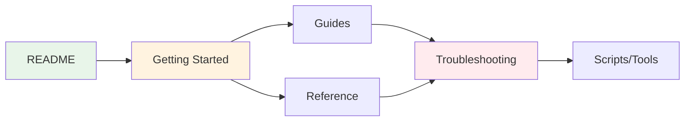

# Documentation

Complete documentation for the Kali Linux Docker Desktop Environment.

## 🚀 Start Here

```bash
# One command starts everything
./start.sh
```

**New to this project?** → [Getting Started](getting-started/README.md)  
**Need help?** → [Troubleshooting](troubleshooting/common-issues.md)  
**Want details?** → Keep reading below

## 📁 Documentation Structure

```
docs/
├── getting-started/    # Installation and first steps
├── guides/            # How-to guides for daily use
├── reference/         # Technical specifications
├── troubleshooting/   # Problem solving
├── architecture/      # System design
└── advanced/          # Historical/specialized topics
```

## 🎯 Quick Navigation

### By Task

| I want to... | Go to |
|-------------|-------|
| Install everything | [Getting Started](getting-started/README.md) |
| Start the desktop | [Quick Start](getting-started/quickstart.md) |
| Run GUI applications | [GUI Applications](guides/gui-applications.md) |
| Use daily | [Daily Usage](guides/daily-usage.md) |
| Analyze malware | [Malware Analysis](guides/malware-analysis.md) |
| Fix problems | [Common Issues](troubleshooting/common-issues.md) |
| See all scripts | [Scripts Reference](reference/scripts.md) |
| View all tools | [Tools List](reference/tools.md) |

### By Experience Level

| Level | Start With | Then Read |
|-------|------------|-----------|
| **Beginner** | [Getting Started](getting-started/README.md) | [Daily Usage](guides/daily-usage.md) |
| **Intermediate** | [Quick Start](getting-started/quickstart.md) | [Scripts Reference](reference/scripts.md) |
| **Expert** | [Scripts Reference](reference/scripts.md) | [System Design](architecture/system-design.md) |

## 📚 Complete Documentation

### Getting Started
- [**Overview**](getting-started/README.md) - Start here for installation
- [**Installation**](getting-started/installation.md) - Detailed setup steps
- [**Quick Start**](getting-started/quickstart.md) - Fast 5-minute setup
- [**Docker Auto-Start**](getting-started/docker-autostart.md) - Automatic Docker management

### Guides
- [**Daily Usage**](guides/daily-usage.md) - Common workflows and tasks
- [**GUI Applications**](guides/gui-applications.md) - Running graphical tools with X11
- [**Malware Analysis**](guides/malware-analysis.md) - Isolated analysis environment
- [**GUI Alternatives**](guides/gui-alternatives.md) - VNC and other options

### Reference
- [**Scripts**](reference/scripts.md) - All 15 essential scripts documented
- [**Tools**](reference/tools.md) - 100+ included security tools
- [**Project Structure**](reference/structure.md) - Repository organization
- [**Quick Reference**](QUICK-REFERENCE.md) - Command cheatsheet

### Troubleshooting
- [**Common Issues**](troubleshooting/common-issues.md) - Solutions to frequent problems
- [**Menu Issues**](troubleshooting/menu-issues.md) - Fixing Kali menu problems
- [**Security**](troubleshooting/security.md) - Security best practices

### Architecture
- [**System Design**](architecture/system-design.md) - How everything works together

### Advanced
- [**Panel Customization**](advanced/panel-customization.md) - UI modifications
- [**Script Migration**](advanced/script-migration.md) - Recent consolidation details
- [**Cleanup History**](advanced/cleanup-history.md) - Project optimization history
- [**Docs History**](advanced/docs-history.md) - Documentation changes

## 🔍 Essential Commands

```bash
# Start/Stop
./start.sh                          # Start everything
./scripts/core/stop.sh             # Stop container

# Access
docker exec -it kali-workspace /bin/zsh    # Shell access
./scripts/desktop/launch-app.sh firefox    # Launch app

# Tools
docker exec kali-workspace /home/kali/scripts/tools/install-core.sh  # Install tools

# Fix Issues
docker exec kali-workspace /home/kali/scripts/desktop/configure-menu.sh  # Fix menus
```

See [Quick Reference](QUICK-REFERENCE.md) for more commands.

## 📊 Current State

- **15 essential scripts** (consolidated from 52)
- **6 documentation categories** for organization
- **100+ security tools** included
- **3 container modes** (standard, malware, isolated)
- **Auto-start Docker** feature
- **Smart error detection** for X server and sessions

## 🔗 How Docs Connect



## 💡 Tips for Using These Docs

1. **Start with Getting Started** if new to the project
2. **Use Quick Reference** for daily command lookup  
3. **Check Troubleshooting** when something breaks
4. **Read Architecture** to understand the design
5. **Advanced section** is mostly historical reference

## 📝 Contributing

When updating docs:
1. Use lowercase filenames with hyphens
2. Keep files in appropriate category folders
3. Update cross-references when moving files
4. Test all commands before documenting
5. Keep language clear and concise

---

**Quick Access:** [Get Started](getting-started/README.md) | [Commands](QUICK-REFERENCE.md) | [Scripts](reference/scripts.md) | [Help](troubleshooting/common-issues.md)