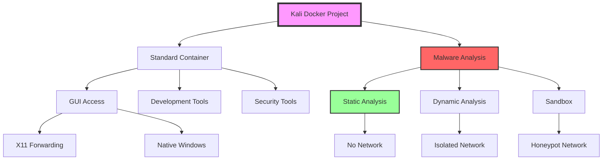

# 📚 Kali Linux Docker Documentation

Welcome to the comprehensive documentation for the Kali Linux Docker Container project. This documentation is designed with visual learners in mind, featuring Mermaid diagrams throughout.

## 📖 Documentation Index

### 🏗️ Architecture & Design
- **[ARCHITECTURE.md](./ARCHITECTURE.md)** - System architecture, container design, and network topology
- **[CONTAINER-LAYERS.md](./CONTAINER-LAYERS.md)** - Docker image layers and build process

### 🚀 Getting Started
- **[SETUP-GUIDE.md](./SETUP-GUIDE.md)** - Complete installation and setup instructions
- **[QUICK-START.md](./QUICK-START.md)** - Fast track guide for experienced users

### 🔒 Security
- **[SECURITY-WARNING.md](./SECURITY-WARNING.md)** ⚠️ - Critical security information (MUST READ)
- **[SECURITY-BEST-PRACTICES.md](./SECURITY-BEST-PRACTICES.md)** - Security guidelines and hardening
- **[MALWARE-ANALYSIS-GUIDE.md](./MALWARE-ANALYSIS-GUIDE.md)** - Safe malware analysis procedures

### 🛠️ Configuration & Usage
- **[CONFIGURATION.md](./CONFIGURATION.md)** - Environment variables and customization
- **[USAGE-GUIDE.md](./USAGE-GUIDE.md)** - Common tasks and workflows
- **[CLAUDE-INTEGRATION.md](./CLAUDE-INTEGRATION.md)** - Setting up and using Claude CLI

### 📦 Tools & Features
- **[TOOLS.md](./TOOLS.md)** - Complete inventory of included tools
- **[SCRIPTS-REFERENCE.md](./SCRIPTS-REFERENCE.md)** - Script documentation and usage

### 🔧 Maintenance
- **[TROUBLESHOOTING.md](./TROUBLESHOOTING.md)** - Common issues and solutions
- **[MAINTENANCE.md](./MAINTENANCE.md)** - Updates, backups, and cleanup

### 📊 Visual Overview

## 🎯 Quick Navigation

### For New Users
1. Start with [SETUP-GUIDE.md](./SETUP-GUIDE.md)
2. Read [SECURITY-WARNING.md](./SECURITY-WARNING.md)
3. Follow [QUICK-START.md](./QUICK-START.md)

### For Malware Analysts
1. **MUST READ**: [SECURITY-WARNING.md](./SECURITY-WARNING.md)
2. Study [MALWARE-ANALYSIS-GUIDE.md](./MALWARE-ANALYSIS-GUIDE.md)
3. Review [SECURITY-BEST-PRACTICES.md](./SECURITY-BEST-PRACTICES.md)

### For Developers
1. Check [ARCHITECTURE.md](./ARCHITECTURE.md)
2. Read [CONFIGURATION.md](./CONFIGURATION.md)
3. See [SCRIPTS-REFERENCE.md](./SCRIPTS-REFERENCE.md)

## 📝 Documentation Standards

All documentation in this project follows these standards:
- **Mermaid Diagrams** for visual representation
- **Clear Headers** with emoji indicators
- **Code Examples** with syntax highlighting
- **Tables** for quick reference
- **Links** to related documentation

## 🔄 Version

Documentation Version: 1.0.0
Last Updated: January 2025
Compatible with: kalilinux/kali-rolling:latest