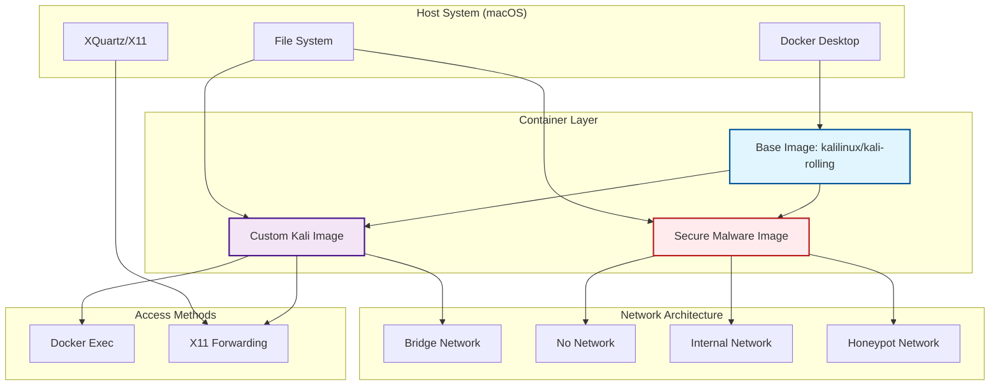
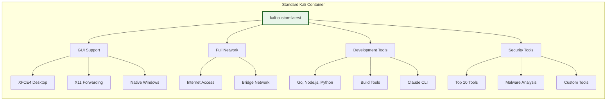
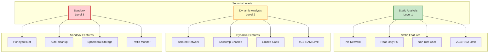
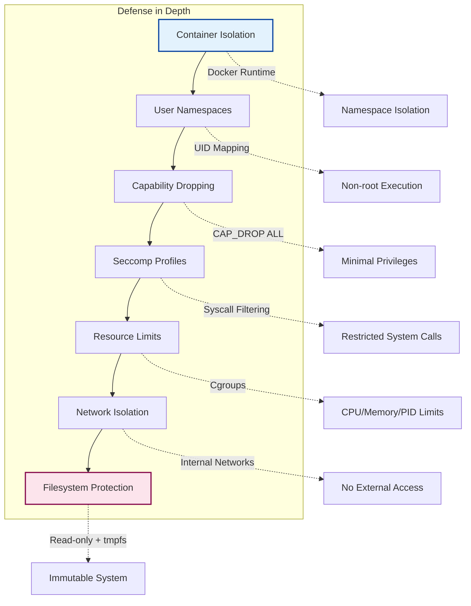
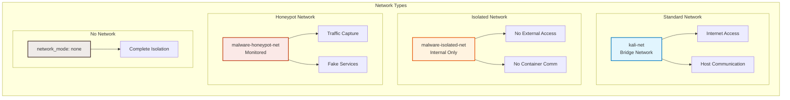
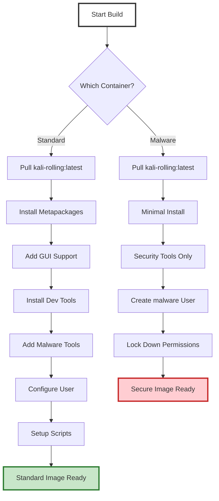
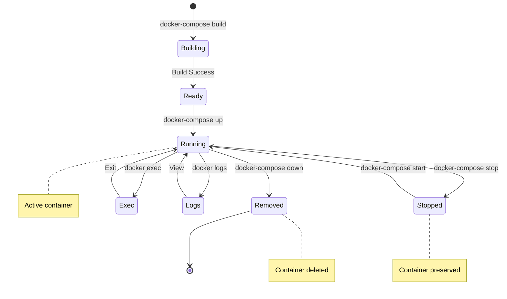
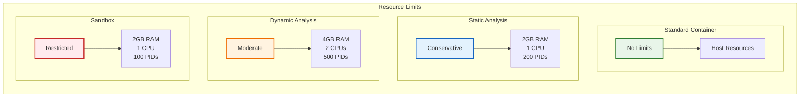
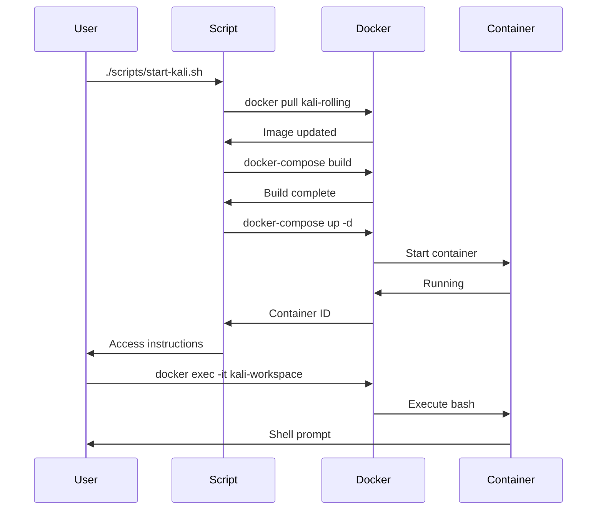
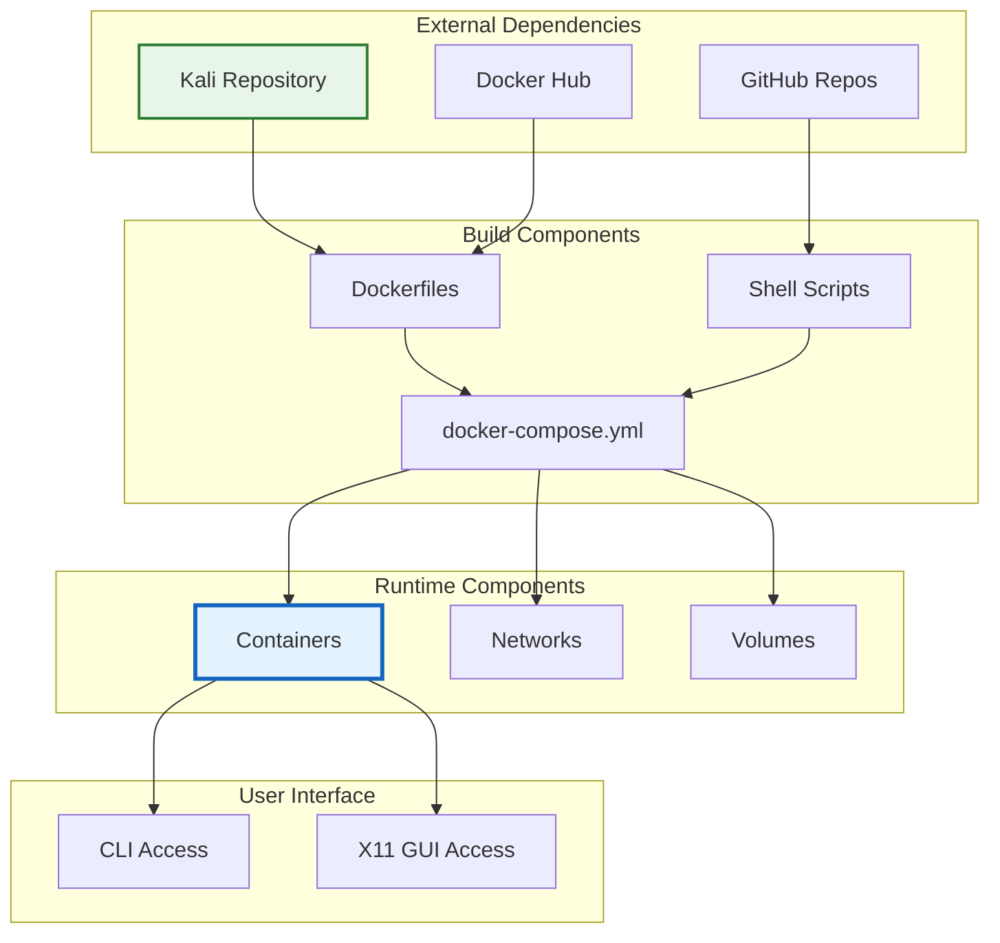

# 🏗️ System Architecture

## Overview

The Kali Linux Docker Container project provides a flexible, secure environment for security testing and malware analysis. The architecture supports multiple use cases through different container configurations.

## 🎨 High-Level Architecture



## 🐋 Container Types

### 1. Standard Kali Container



### 2. Malware Analysis Containers



## 🔐 Security Architecture



## 🌐 Network Architecture



## 📁 Storage Architecture

```mermaid
graph TD
    subgraph "Persistent Storage"
        Host[Host Filesystem]
        Workspace[./workspace]
        Config[./config]
        Malware[./malware/]
    end
    
    subgraph "Container Mounts"
        CW[/home/kali/workspace]
        CC[/home/kali/.config]
        CS[/samples :ro]
        CR[/reports :rw]
    end
    
    subgraph "Ephemeral Storage"
        Tmp[/tmp - tmpfs]
        VarTmp[/var/tmp - tmpfs]
        Cache[/.cache - tmpfs]
    end
    
    Workspace --> |Read/Write| CW
    Config --> |Read/Write| CC
    Malware --> |Read Only| CS
    Malware --> |Write Only| CR
    
    Host --> Tmp
    Host --> VarTmp
    Host --> Cache
    
    style Host fill:#f5f5f5,stroke:#424242,stroke-width:3px
    style Tmp fill:#e8f5e9,stroke:#2e7d32,stroke-width:2px
```

## 🚀 Build Process



## 🔄 Container Lifecycle



## 📊 Resource Management



## 🎯 Use Case Flows



## 🏛️ Design Principles

1. **Layered Security**: Multiple isolation mechanisms
2. **Least Privilege**: Minimal capabilities by default
3. **Flexibility**: Multiple configuration options
4. **Persistence**: Separate data from containers
5. **Monitoring**: Logging and capture capabilities
6. **Automation**: Scripted workflows
7. **Documentation**: Clear usage patterns

## 🔗 Component Relationships

