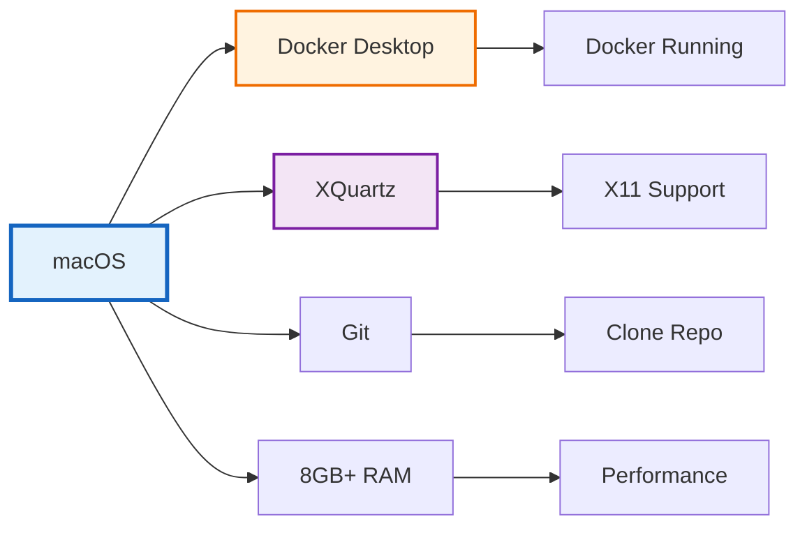
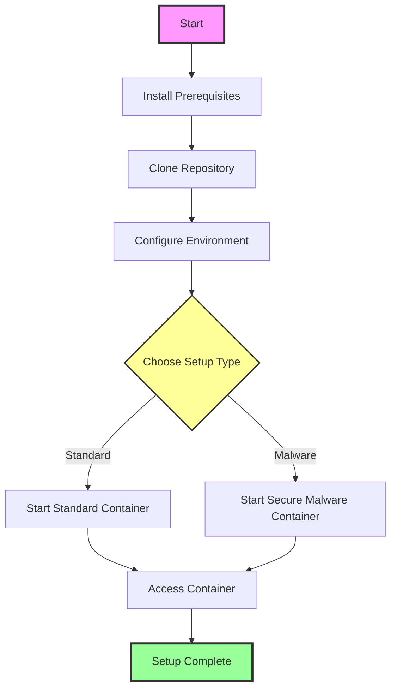
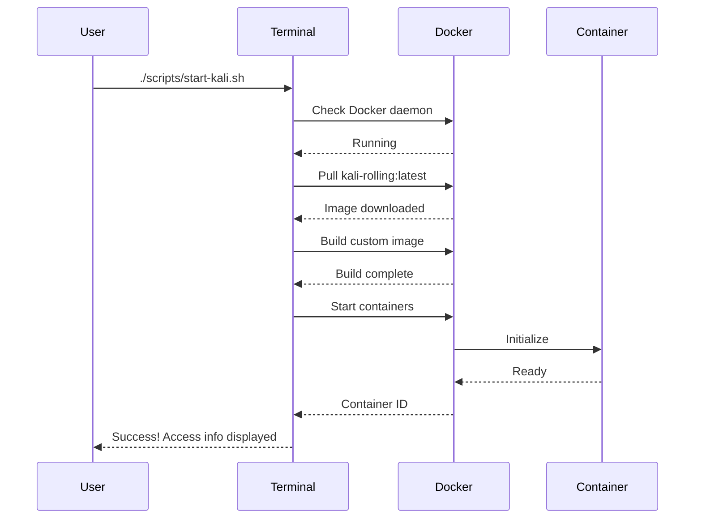
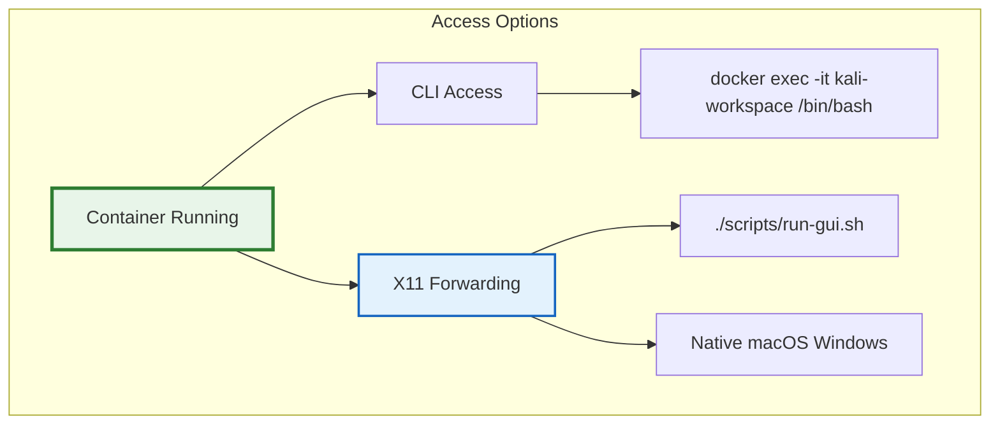
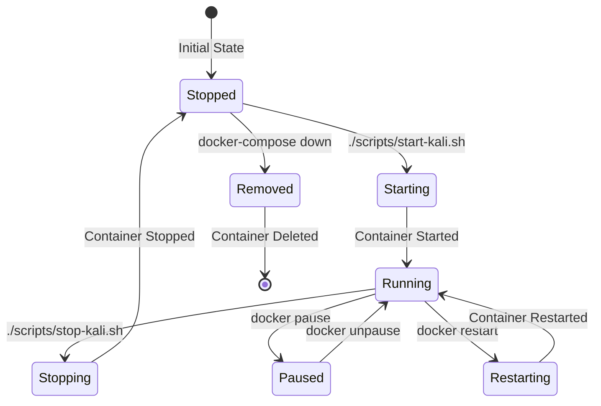
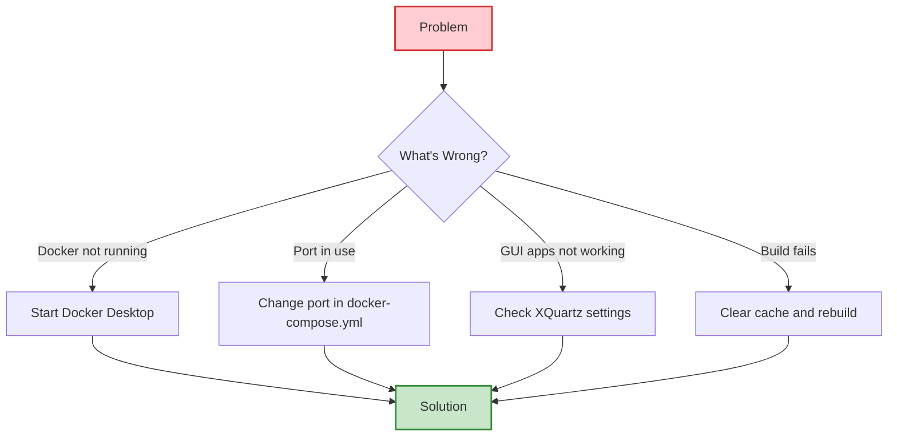

# 🚀 Complete Setup Guide

This guide will walk you through setting up the Kali Linux Docker containers from start to finish.

## 📋 Prerequisites



### System Requirements

| Component | Minimum | Recommended |
|-----------|---------|-------------|
| macOS | 10.15 (Catalina) | 12.0+ (Monterey) |
| RAM | 8GB | 16GB+ |
| Storage | 20GB free | 50GB+ free |
| CPU | Intel/M1 | M1/M2 Pro |

### Required Software

1. **Docker Desktop for Mac**
   ```bash
   # Download from Docker website or use Homebrew
   brew install --cask docker
   ```

2. **XQuartz** (for GUI support)
   ```bash
   brew install --cask xquartz
   # Restart required after installation
   ```

3. **Git** (usually pre-installed)
   ```bash
   # Verify installation
   git --version
   ```

## 🔧 Installation Steps



### Step 1: Clone the Repository

```bash
# Clone the repository
git clone https://github.com/yourusername/kali-docker.git
cd kali-docker

# Or download and extract ZIP
curl -L https://github.com/yourusername/kali-docker/archive/main.zip -o kali-docker.zip
unzip kali-docker.zip
cd kali-docker-main
```

### Step 2: Configure Environment

```bash
# Copy environment template
cp .env.example .env

# Edit .env file
nano .env
```

#### For Claude Max/Pro Users:
```env
CLAUDE_AUTH_METHOD=max
# Leave ANTHROPIC_API_KEY empty
```

#### For API Key Users:
```env
CLAUDE_AUTH_METHOD=api
ANTHROPIC_API_KEY=your-api-key-here
```

### Step 3: Initial Setup



Run the setup:
```bash
# Make scripts executable
chmod +x scripts/*.sh

# Start standard Kali container
./scripts/start-kali.sh
```

### Step 4: Verify Installation

```bash
# Check running containers
docker ps

# You should see:
CONTAINER ID   IMAGE              CONTAINER NAME    STATUS
xxxxxxxxxxxx   kali-custom:latest kali-workspace   Up 2 minutes
```

## 🖥️ Access Methods



### 1. Command Line Interface (CLI)

```bash
# Basic access
docker exec -it kali-workspace /bin/bash

# As root (if needed)
docker exec -it -u root kali-workspace /bin/bash

# Run specific command
docker exec kali-workspace nmap --version
```

### 2. GUI Access via X11 Forwarding

```bash
# GUI apps run as native macOS windows
./scripts/run-gui.sh firefox
./scripts/run-gui.sh burpsuite

# Or run full desktop
./scripts/run-gui.sh startxfce4
```

## 🐋 Container Management



### Common Commands

| Action | Command |
|--------|---------|
| Start containers | `./scripts/start-kali.sh` |
| Stop containers | `./scripts/stop-kali.sh` |
| Restart container | `docker restart kali-workspace` |
| View logs | `docker logs kali-workspace` |
| Remove containers | `docker-compose down` |
| Remove everything | `docker-compose down -v --rmi all` |

## 🔧 Post-Installation Setup

### 1. Install Additional Tools

```bash
# Inside container
docker exec -it kali-workspace /bin/bash

# Run setup script
/home/kali/scripts/setup-tools.sh
```

### 2. Configure Claude CLI

```bash
# For Max/Pro users
docker exec -it kali-workspace /home/kali/scripts/setup-claude.sh
# Select option 1

# For API key users (if not auto-configured)
docker exec -it kali-workspace /home/kali/scripts/setup-claude.sh
# Select option 2
```

### 3. Setup Malware Analysis Environment

```bash
# Inside container
docker exec -it kali-workspace /home/kali/scripts/setup-malware-analysis.sh
```

## 🚨 Troubleshooting Quick Fixes



### Common Issues

1. **Docker daemon not running**
   ```bash
   # Start Docker Desktop
   open -a Docker
   ```

2. **Port already in use**
   ```bash
   # Find process using port
   lsof -i :5901
   # Change port in docker-compose.yml
   ```

3. **XQuartz connection refused**
   ```bash
   # Allow connections
   defaults write org.xquartz.X11 enable_iglx -bool true
   xhost +localhost
   ```

## ✅ Verification Checklist

- [ ] Docker Desktop is running
- [ ] Container shows as "Up" in `docker ps`
- [ ] Can access CLI with `docker exec`
- [ ] X11 forwarding works (GUI apps open)
- [ ] Persistent storage mounted correctly
- [ ] Network connectivity works (ping google.com)

## 📚 Next Steps

1. Read [USAGE-GUIDE.md](./USAGE-GUIDE.md) for common workflows
2. Check [SECURITY-WARNING.md](./SECURITY-WARNING.md) for security info
3. Explore [TOOLS.md](./TOOLS.md) for available tools
4. Configure settings in [CONFIGURATION.md](./CONFIGURATION.md)

## 🆘 Getting Help

If you encounter issues:
1. Check [TROUBLESHOOTING.md](./TROUBLESHOOTING.md)
2. Review container logs: `docker logs kali-workspace`
3. Verify prerequisites are installed
4. Ensure sufficient system resources