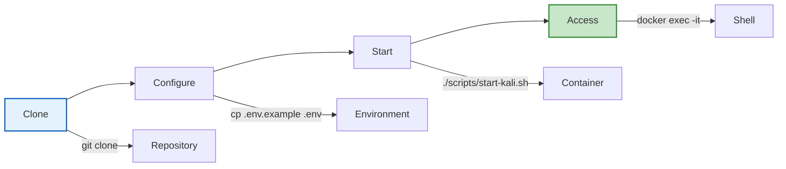
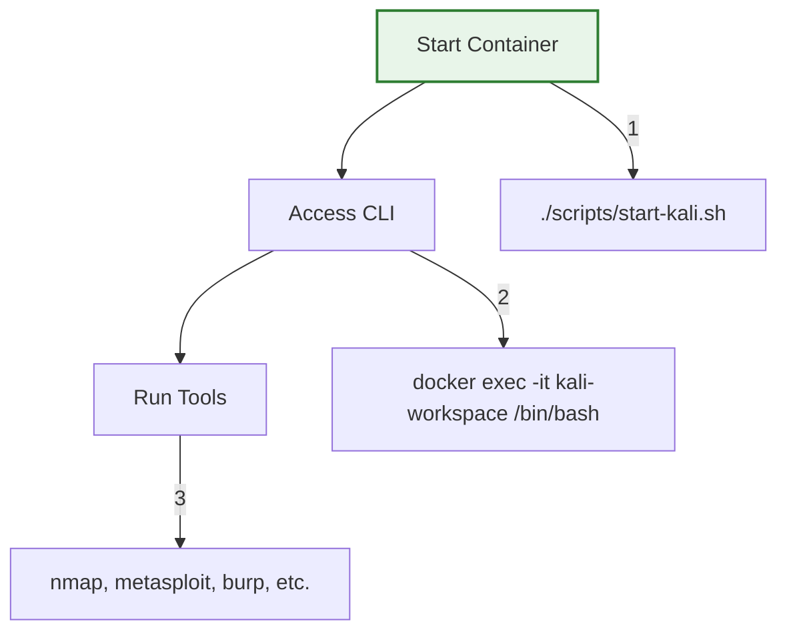
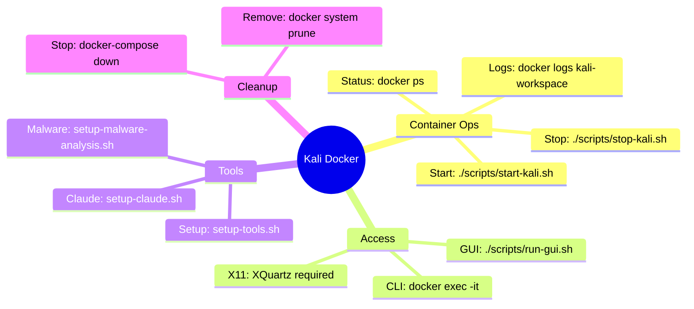

# ⚡ Quick Start Guide

For experienced users who want to get up and running fast.

## 🏃 TL;DR Setup



```bash
# One-liner setup (copy entire block)
git clone https://github.com/yourusername/kali-docker.git && \
cd kali-docker && \
cp .env.example .env && \
chmod +x scripts/*.sh && \
./scripts/start-kali.sh
```

## 🎯 Quick Access

### Standard Kali Container

| Method | Command | Notes |
|--------|---------|-------|
| CLI | `docker exec -it kali-workspace /bin/bash` | Direct shell access |
| GUI | `./scripts/run-gui.sh <app>` | Requires XQuartz |

### Secure Malware Analysis

```bash
# Start secure environment
./scripts/start-secure-malware-lab.sh
# Choose: 1 (static), 2 (dynamic), or 3 (sandbox)
```

## 🚀 5-Minute Workflows

### 1. Basic Security Testing



```bash
# Quick security scan
docker exec -it kali-workspace bash -c "nmap -sV target.com"

# Start Metasploit
docker exec -it kali-workspace msfconsole

# Run Burp Suite (needs GUI)
./scripts/run-gui.sh burpsuite
```

### 2. Malware Analysis (Safe)

```bash
# Place sample in ./malware/samples/
cp suspicious.exe ./malware/samples/

# Start static analysis
./scripts/start-secure-malware-lab.sh
# Select: 1

# Analyze
docker exec -it kali-malware-static /home/malware/safe-analyze.sh /samples/suspicious.exe
```

### 3. Development Environment

```bash
# Access with mounted workspace
docker exec -it kali-workspace /bin/bash
cd /home/kali/workspace

# Your files from ./workspace are here
# Edit on host, run in container
```

## 🛠️ Essential Commands



## 📌 Quick Configuration

### Claude Max Plan
```bash
echo "CLAUDE_AUTH_METHOD=max" > .env
```

### Claude API Key
```bash
echo "ANTHROPIC_API_KEY=sk-ant-..." > .env
```

### Custom Network
```yaml
# Edit docker-compose.yml if needed
networks:
  kali-net:
    driver: bridge
```

## 🔥 Pro Tips

1. **Persistent Bash History**
   ```bash
   docker exec -it kali-workspace bash -c "echo 'HISTSIZE=10000' >> ~/.bashrc"
   ```

2. **Quick Tool Check**
   ```bash
   docker exec kali-workspace bash -c "nmap --version && msfconsole --version"
   ```

3. **Auto-start on Boot**
   ```bash
   docker update --restart unless-stopped kali-workspace
   ```

4. **Resource Limits**
   ```bash
   docker update --memory="4g" --cpus="2" kali-workspace
   ```

## 🚄 Speed Run Setup

For the absolutely impatient:

```bash
# Fastest possible setup (no GUI)
docker run -it --rm kalilinux/kali-rolling /bin/bash

# With persistence
docker run -it --name quick-kali -v $(pwd):/workspace kalilinux/kali-rolling
```

But you'll miss all our enhancements! 😉

## 📊 Container Health Check

```bash
# Quick health check
docker exec kali-workspace bash -c "
echo '=== System Info ==='
uname -a
echo '=== Memory ==='
free -h
echo '=== Disk ==='
df -h
echo '=== Network ==='
ip a | grep inet
echo '=== Tools ==='
which nmap msfconsole burpsuite
"
```

## 🎮 Keyboard Shortcuts

| Action | Shortcut |
|--------|----------|
| Exit container | `Ctrl+D` or `exit` |
| Clear terminal | `Ctrl+L` |
| Stop command | `Ctrl+C` |
| Background task | `Ctrl+Z` |
| Search history | `Ctrl+R` |

## 🔗 Quick Links

- Problems? → [TROUBLESHOOTING.md](./TROUBLESHOOTING.md)
- Security? → [SECURITY-WARNING.md](./SECURITY-WARNING.md)
- All tools? → [TOOLS.md](./TOOLS.md)
- Deep dive? → [ARCHITECTURE.md](./ARCHITECTURE.md)

---

**Ready to hack? You're all set! 🚀**