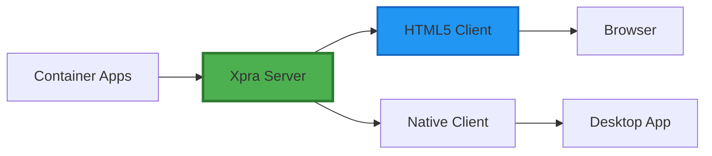
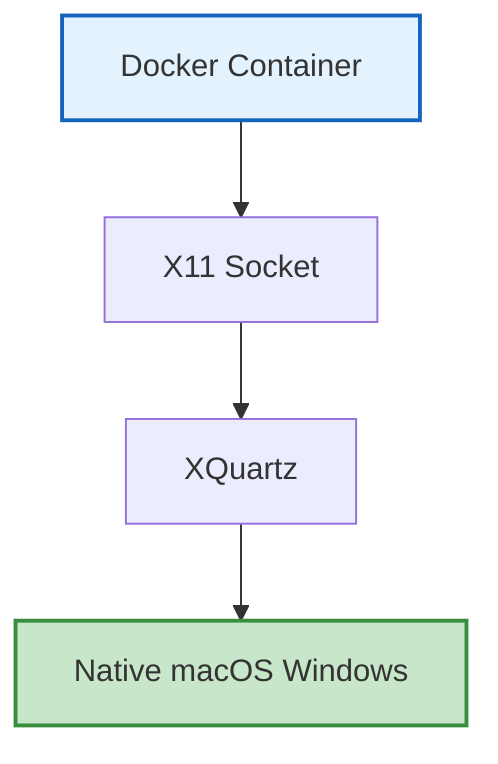
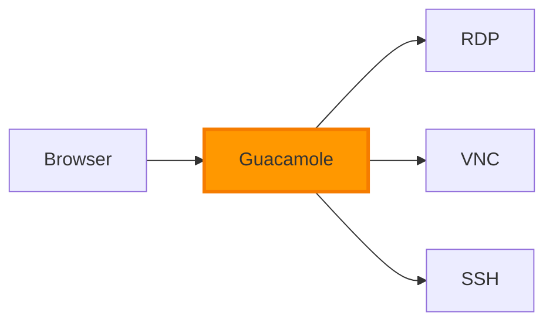
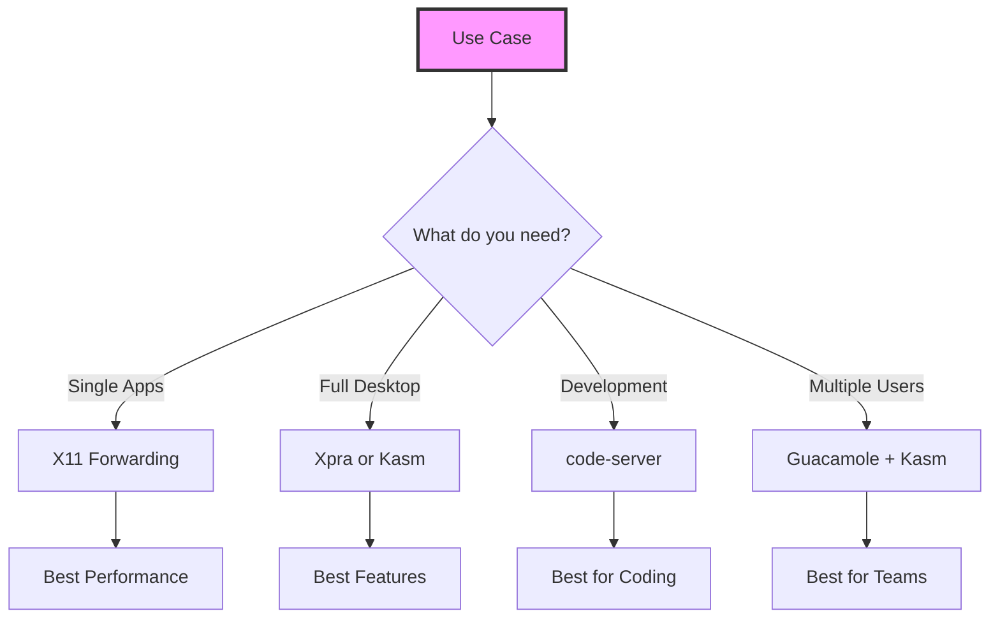

# 🚀 Modern GUI Solutions for Docker Containers (2025)

VNC is outdated and has many issues. Here are better, more current solutions:

## 🎯 Recommended Modern Solutions

### 1. **Xpra (Best Overall)** ⭐⭐⭐⭐⭐

Xpra is a modern "screen for X11" that provides seamless application streaming.



**Advantages:**
- Individual application windows (not full desktop)
- HTML5 client - no software needed
- Better performance than VNC
- Audio support
- Clipboard sync
- File transfer
- Automatic reconnection

**Implementation:**
```dockerfile
# Add to Dockerfile
RUN apt-get install -y xpra xvfb

# Start command
CMD xpra start :100 --bind-tcp=0.0.0.0:10000 --html=on --daemon=no
```

### 2. **X11 Forwarding with XQuartz (Native Feel)** ⭐⭐⭐⭐

Run GUI apps as native macOS windows.



**Advantages:**
- Native window management
- Best performance
- No desktop needed
- Seamless integration

**Setup:**
```bash
# Install XQuartz
brew install --cask xquartz

# Run container with X11
docker run -e DISPLAY=host.docker.internal:0 \
           -v /tmp/.X11-unix:/tmp/.X11-unix \
           kali-custom
```

### 3. **Kasm Workspaces (Enterprise Grade)** ⭐⭐⭐⭐⭐

Modern streaming platform designed for containers.

```yaml
# docker-compose.yml
services:
  kali-kasm:
    image: kasmweb/core-kali-rolling:develop
    ports:
      - "6901:6901"
    environment:
      - VNC_PW=password
```

**Advantages:**
- Built for containers
- Hardware acceleration
- Multi-user support
- Enterprise features
- Modern web UI

### 4. **Apache Guacamole (Gateway Solution)** ⭐⭐⭐⭐

Clientless remote desktop gateway.



**Advantages:**
- No client needed
- Protocol gateway (VNC, RDP, SSH)
- Multi-factor auth
- Recording capabilities
- Connection management

### 5. **code-server (VSCode in Browser)** ⭐⭐⭐⭐

For development work, skip desktop entirely.

```bash
docker run -p 8080:8080 \
  -v "$PWD:/home/coder/project" \
  codercom/code-server:latest
```

**Advantages:**
- Full VS Code in browser
- Terminal access
- Extensions support
- No desktop needed

## 📊 Comparison Matrix

| Solution | Performance | Ease of Use | Features | Modern | Resource Usage |
|----------|------------|-------------|----------|---------|----------------|
| VNC | ⭐⭐ | ⭐⭐⭐ | ⭐⭐ | ⭐ | Heavy |
| noVNC | ⭐⭐ | ⭐⭐⭐⭐ | ⭐⭐ | ⭐⭐ | Heavy |
| X11 | ⭐⭐⭐⭐⭐ | ⭐⭐⭐ | ⭐⭐⭐ | ⭐⭐⭐ | Light |
| Xpra | ⭐⭐⭐⭐ | ⭐⭐⭐⭐ | ⭐⭐⭐⭐⭐ | ⭐⭐⭐⭐⭐ | Medium |
| Kasm | ⭐⭐⭐⭐ | ⭐⭐⭐⭐⭐ | ⭐⭐⭐⭐⭐ | ⭐⭐⭐⭐⭐ | Medium |
| Guacamole | ⭐⭐⭐ | ⭐⭐⭐⭐⭐ | ⭐⭐⭐⭐ | ⭐⭐⭐⭐ | Light |

## 🚀 Quick Implementation Guide

### Option 1: Xpra (Recommended)

```yaml
# docker-compose.xpra.yml
version: '3.8'

services:
  kali-xpra:
    build:
      context: .
      dockerfile: docker/xpra/Dockerfile
    ports:
      - "10000:10000"  # Xpra HTML5
    environment:
      - DISPLAY=:100
    volumes:
      - ./workspace:/workspace
    command: xpra start :100 --bind-tcp=0.0.0.0:10000 --html=on --daemon=no
```

**Access:** http://localhost:10000

### Option 2: Native X11 (Best Performance)

```bash
# Start XQuartz
open -a XQuartz

# Allow connections
xhost +localhost

# Run with X11
docker run -it --rm \
  -e DISPLAY=host.docker.internal:0 \
  -v /tmp/.X11-unix:/tmp/.X11-unix \
  kali-custom firefox
```

### Option 3: Modern Web Desktop (Kasm)

```yaml
# docker-compose.kasm.yml
version: '3.8'

services:
  kali-kasm:
    image: kasmweb/kali-rolling:1.14.0
    ports:
      - "6901:6901"
    environment:
      - VNC_PW=password
    shm_size: '2gb'
    volumes:
      - ./workspace:/workspace
```

**Access:** https://localhost:6901

## 🎯 Recommendations by Use Case



### For Security Testing:
- **X11 Forwarding** - Run Burp Suite, Wireshark as native windows
- **Xpra** - Better for long sessions, handles disconnects

### For Development:
- **code-server** - Full VS Code experience
- **X11 + Terminal** - Traditional Unix workflow

### For Full Desktop:
- **Kasm** - Most modern, best features
- **Xpra** - Good balance of features/performance

### For Teams:
- **Guacamole + Kasm** - Enterprise solution
- **Jupyter Hub** - For data science teams

## 🛠️ Migration from VNC

To migrate from VNC to a modern solution:

1. **Choose your solution** based on use case
2. **Update Dockerfile** with new packages
3. **Modify docker-compose.yml** for new ports
4. **Update documentation** for users
5. **Test thoroughly** before switching

## 🔮 Future-Proof Solutions (2025+)

- **WebGPU** support for graphics acceleration
- **WebRTC** based streaming (lower latency)
- **Wayland** support (replacing X11)
- **Container-native** display servers

## 📚 Resources

- [Xpra Documentation](https://xpra.org/)
- [Kasm Workspaces](https://kasmweb.com/)
- [Apache Guacamole](https://guacamole.apache.org/)
- [code-server](https://github.com/coder/code-server)
- [X11 on macOS](https://www.xquartz.org/)

---

**Bottom Line:** VNC is 30+ years old. Use Xpra for flexibility, Kasm for features, or X11 for simplicity. All are better than VNC!