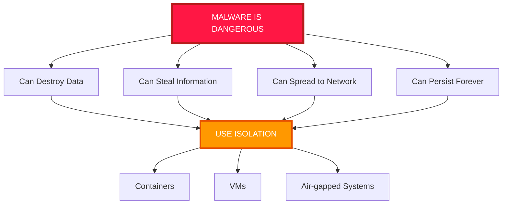
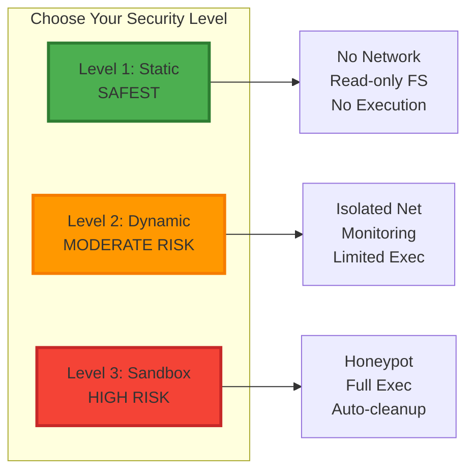
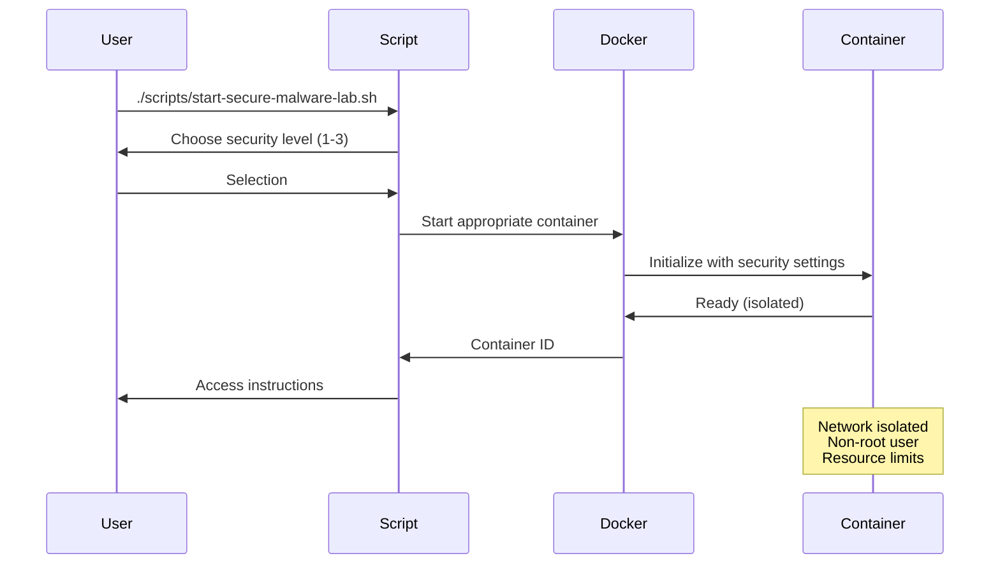
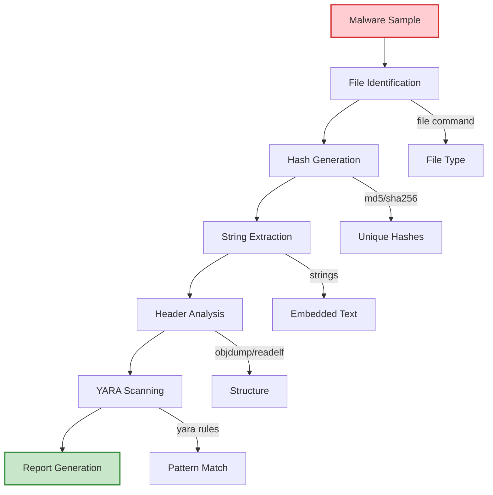
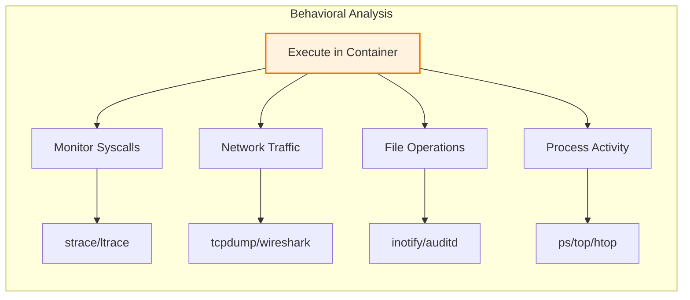
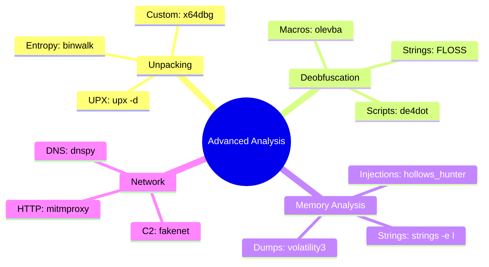
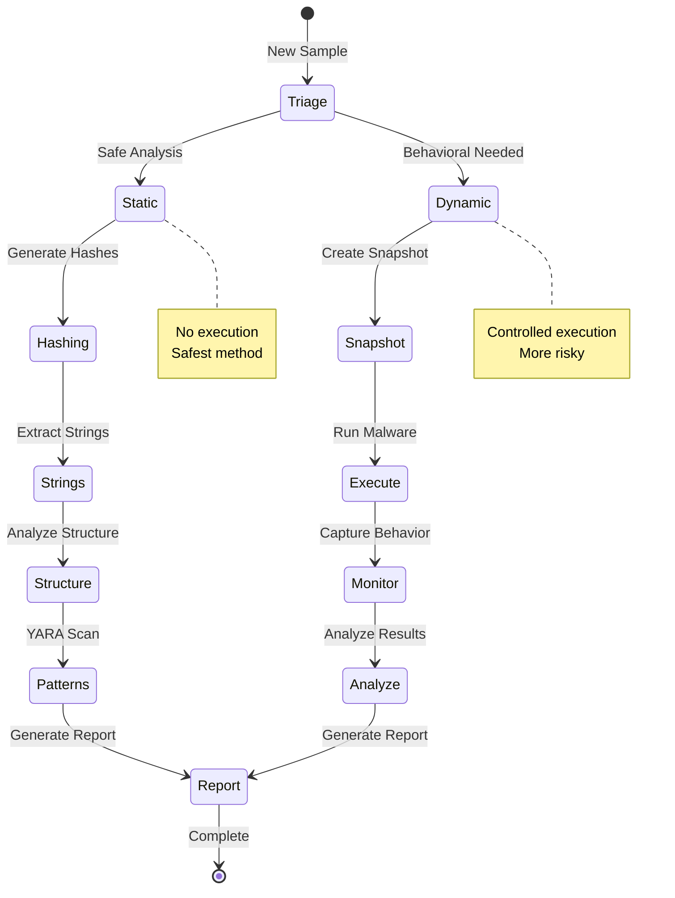

# 🔬 Malware Analysis Guide

A comprehensive guide for safely analyzing malware using our containerized environment.

## ⚠️ Critical Safety Warning



**NEVER analyze malware on:**
- Your primary computer
- Systems with important data
- Networks with other devices
- Without proper isolation

## 🛡️ Security Levels



## 🚀 Getting Started

### Step 1: Prepare Your Environment

```bash
# Create malware directories (if not exist)
mkdir -p malware/samples malware/reports malware/captures

# Set restrictive permissions
chmod 700 malware/samples
chmod 755 malware/reports
```

### Step 2: Start Secure Environment



```bash
# Start the secure environment
./scripts/start-secure-malware-lab.sh

# Choose your level:
# 1 = Static Analysis (Recommended)
# 2 = Dynamic Analysis
# 3 = Full Sandbox (Dangerous)
```

### Step 3: Transfer Samples Safely

```bash
# Copy malware to analysis directory
# ALWAYS use .malware extension for safety
cp suspicious_file ./malware/samples/suspicious_file.malware

# Set read-only
chmod 444 ./malware/samples/suspicious_file.malware
```

## 📊 Analysis Workflows

### 1. Static Analysis (Level 1)



**Inside the container:**
```bash
# Access static analysis container
docker exec -it kali-malware-static /bin/bash

# Use automated analysis
/home/malware/safe-analyze.sh /samples/suspicious_file.malware

# Manual analysis
file /samples/suspicious_file.malware
strings -n 10 /samples/suspicious_file.malware | head -100
xxd /samples/suspicious_file.malware | head -50
```

### 2. Dynamic Analysis (Level 2)



**Setup monitoring:**
```bash
# Terminal 1: Start network capture
docker exec -it malware-monitor /bin/sh
tcpdump -i eth0 -w /captures/malware_$(date +%s).pcap

# Terminal 2: Access dynamic container
docker exec -it kali-malware-dynamic /bin/bash

# Monitor system calls
strace -f -e trace=file,network,process ./malware 2>&1 | tee syscalls.log

# Monitor library calls
ltrace ./malware 2>&1 | tee libcalls.log
```

### 3. Advanced Techniques



## 🔍 Analysis Tools

### Static Analysis Arsenal

| Tool | Purpose | Usage |
|------|---------|-------|
| `file` | Identify file type | `file malware.exe` |
| `strings` | Extract text | `strings -n 8 malware.exe` |
| `hexdump` | View hex/ASCII | `hexdump -C malware.exe \| less` |
| `binwalk` | Find embedded files | `binwalk -e malware.exe` |
| `yara` | Pattern matching | `yara rules.yar malware.exe` |
| `objdump` | Disassemble | `objdump -d malware.exe` |
| `readelf` | ELF analysis | `readelf -a malware.elf` |
| `pescan` | PE analysis | `pescan malware.exe` |

### Dynamic Analysis Tools

| Tool | Purpose | Usage |
|------|---------|-------|
| `strace` | System calls | `strace -f ./malware` |
| `ltrace` | Library calls | `ltrace ./malware` |
| `gdb` | Debugging | `gdb ./malware` |
| `tcpdump` | Network capture | `tcpdump -i any -w out.pcap` |
| `wireshark` | Packet analysis | `wireshark out.pcap` |
| `ps` | Process monitoring | `ps aux \| grep malware` |
| `lsof` | Open files | `lsof -p PID` |

## 📝 Analysis Workflow



## 🧪 Sample Analysis

### Example: Analyzing a Suspicious PE File

```bash
# 1. Initial Triage
docker exec -it kali-malware-static /bin/bash

# Basic info
file /samples/suspicious.exe
# Output: PE32 executable (GUI) Intel 80386, for MS Windows

# 2. Generate hashes
md5sum /samples/suspicious.exe    # 5d41402abc4b2a76b9719d911017c592
sha256sum /samples/suspicious.exe  # e3b0c44298fc1c149afbf4c8996fb92427ae41e4649b934ca495991b7852b855

# 3. Extract strings
strings -n 10 /samples/suspicious.exe | grep -E "(http|ftp|cmd|powershell|registry)"
# Output: 
# http://malicious-site.com/payload
# cmd.exe /c whoami
# HKEY_CURRENT_USER\Software\Microsoft\Windows\CurrentVersion\Run

# 4. Check for packers
strings /samples/suspicious.exe | grep -i upx
# Output: UPX!

# 5. Unpack if needed
upx -d /samples/suspicious.exe -o /tmp/unpacked.exe

# 6. Deeper analysis on unpacked
strings /tmp/unpacked.exe | grep -i "password\|login\|steal"
```

## 🛠️ YARA Rules

### Setting Up YARA Rules

```bash
# Inside container
cd ~/malware-analysis
./setup-malware-analysis.sh  # Downloads rule repos

# Use YARA
yara -r ~/malware-analysis/yara-rules/rules.yar /samples/malware.exe
```

### Custom YARA Rule Example

```yara
rule Suspicious_Strings
{
    meta:
        description = "Detects suspicious strings"
        author = "Security Team"
        date = "2025-01-01"
    
    strings:
        $a = "cmd.exe" nocase
        $b = "powershell" nocase
        $c = "bypass" nocase
        $d = "hidden" nocase
        $e = /https?:\/\/[a-z0-9]{6,10}\.(tk|ml|ga)/
        
    condition:
        2 of them
}
```

## 📊 Reporting

### Report Template

```markdown
# Malware Analysis Report

## File Information
- **Filename**: suspicious.exe
- **MD5**: 5d41402abc4b2a76b9719d911017c592
- **SHA256**: e3b0c44298fc1c149afbf4c8996fb92427ae41e4649b934ca495991b7852b855
- **File Type**: PE32 executable
- **Size**: 125,440 bytes

## Static Analysis
- **Packer**: UPX 3.96
- **Suspicious Strings**: 
  - C2 Server: http://malicious-site.com
  - Commands: cmd.exe, powershell -bypass
- **Imports**: WinHTTP, CreateProcess, RegSetValue

## Behavioral Analysis
- **Network**: Connects to 192.168.1.100:8080
- **Filesystem**: Creates C:\Windows\Temp\update.exe
- **Registry**: HKCU\Software\Microsoft\Windows\CurrentVersion\Run
- **Processes**: Spawns cmd.exe with elevated privileges

## Indicators of Compromise (IOCs)
- **URLs**: http://malicious-site.com/payload
- **IPs**: 192.168.1.100
- **Files**: C:\Windows\Temp\update.exe
- **Registry**: HKCU\Software\Microsoft\Windows\CurrentVersion\Run\Update

## Classification
**Verdict**: Trojan.Generic.Downloader
**Risk Level**: High
```

## 🚨 Emergency Procedures

```mermaid
graph TD
    A[Suspected Escape] --> B[IMMEDIATELY]
    B --> C[Disconnect Network]
    B --> D[Kill All Containers]
    B --> E[Do NOT Shutdown]
    
    C --> F[Physical Cable/WiFi]
    D --> G[docker kill $(docker ps -q)]
    E --> H[Preserve Memory]
    
    F --> I[Incident Response]
    G --> I
    H --> I
    
    I --> J[Scan System]
    I --> K[Check Processes]
    I --> L[Review Logs]
    
    style A fill:#ff1744,stroke:#d50000,stroke-width:4px
    style B fill:#ff5252,stroke:#d50000,stroke-width:3px
    style I fill:#ff9800,stroke:#f57c00,stroke-width:2px
```

## 📚 Best Practices

1. **Always use the secure containers** - Never the standard one
2. **One sample at a time** - Don't analyze multiple simultaneously
3. **Document everything** - Keep detailed notes
4. **Hash before and after** - Verify file integrity
5. **Network isolation** - Always verify before running
6. **Time limits** - Set maximum analysis time
7. **Clean environment** - Fresh container for each sample
8. **Backup first** - Before any analysis

## 🔗 Additional Resources

- [Malware Bazaar](https://bazaar.abuse.ch/) - Malware samples
- [Hybrid Analysis](https://www.hybrid-analysis.com/) - Online sandbox
- [Any.run](https://any.run/) - Interactive sandbox
- [VirusTotal](https://www.virustotal.com/) - Multi-AV scanning
- [MalAPI.io](https://malapi.io/) - API documentation
- [MITRE ATT&CK](https://attack.mitre.org/) - Tactics database

---

**Remember: When in doubt, DON'T execute! Static analysis is always safer.**