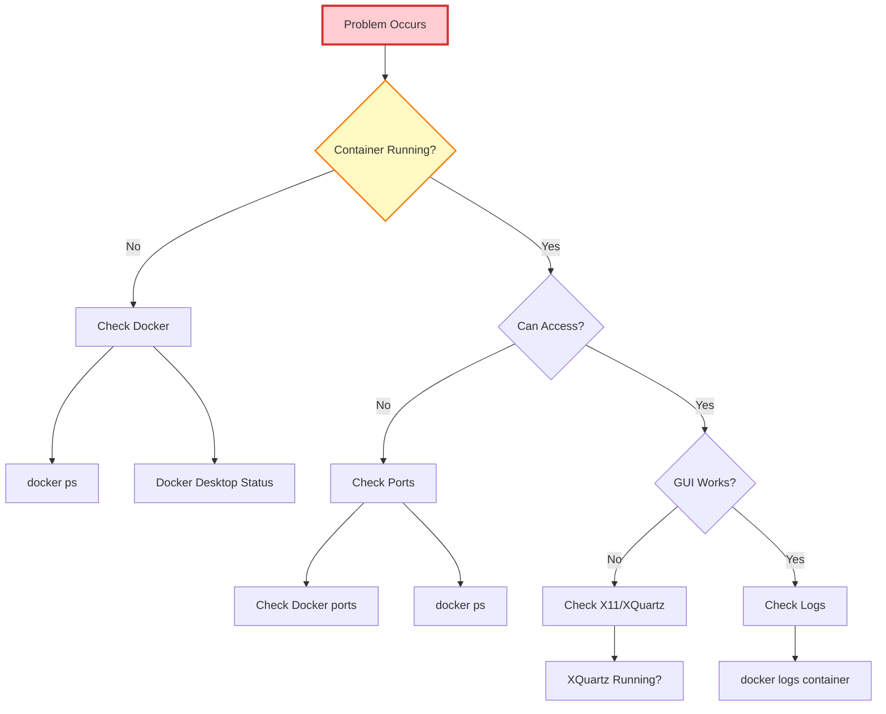
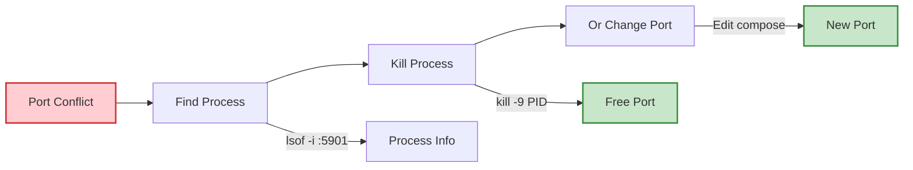
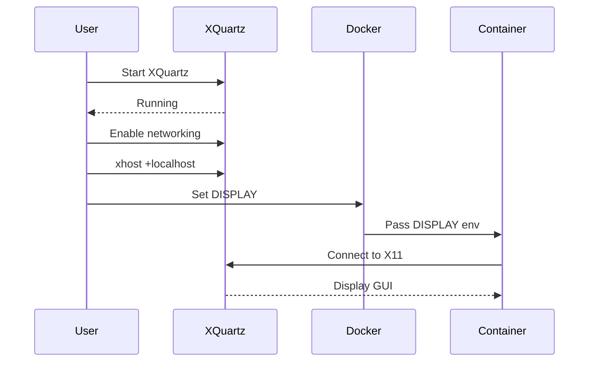
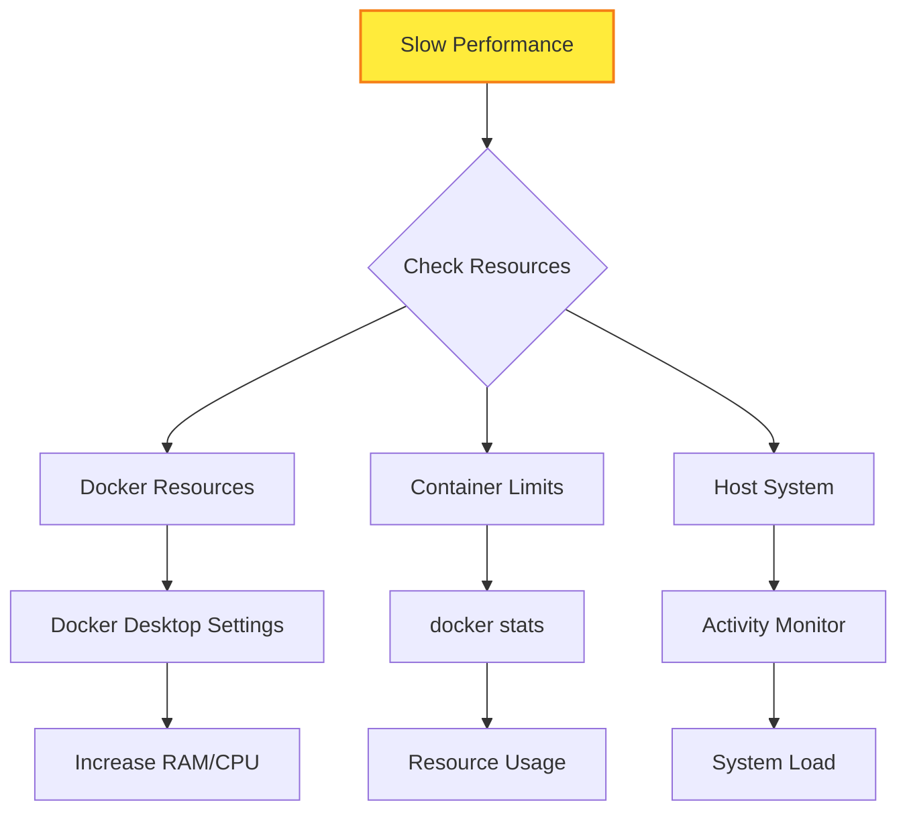
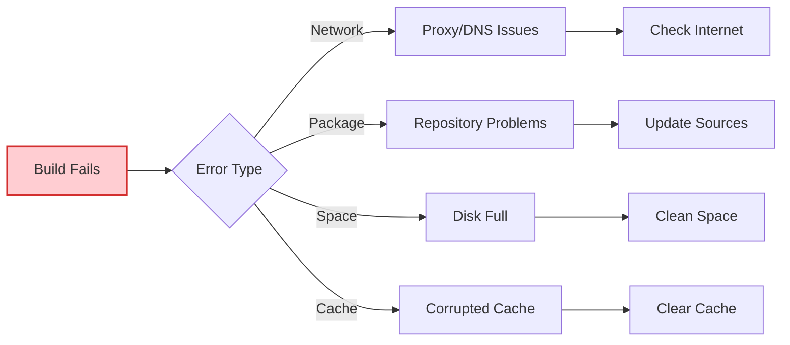
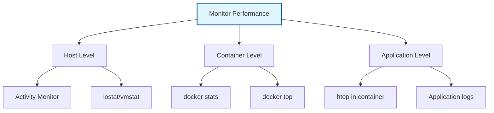

# 🔧 Troubleshooting Guide

This guide helps you resolve common issues with the Kali Linux Docker containers.

## 🚨 Quick Diagnosis



## 🐛 Common Issues & Solutions

### 1. Docker Daemon Not Running

**Symptoms:**
```
Cannot connect to the Docker daemon at unix:///var/run/docker.sock
```

**Solution:**
```bash
# Start Docker Desktop
open -a Docker

# Wait for Docker to start (check menu bar icon)
# Verify Docker is running
docker version

# If still not working, restart Docker Desktop
osascript -e 'quit app "Docker"'
sleep 5
open -a Docker
```

### 2. Port Already in Use

**Symptoms:**
```
Error: bind: address already in use
```

**Diagnosis & Fix:**


```bash
# Find what's using the port
lsof -i :5901
lsof -i :6080

# Kill the process (replace PID)
kill -9 <PID>

# Or change ports in docker-compose.yml if needed
```

### 3. X11 Forwarding Not Working

**Symptoms:**
- GUI apps won't start
- "Cannot open display" errors

**Fix Process:**



```bash
# 1. Start XQuartz
open -a XQuartz

# 2. Configure XQuartz
defaults write org.xquartz.X11 enable_iglx -bool true
defaults write org.xquartz.X11 nolisten_tcp -bool false

# 3. Allow connections
xhost +localhost
xhost +$(ipconfig getifaddr en0)

# 4. Test with simple X11 app
docker exec -e DISPLAY=host.docker.internal:0 kali-workspace xclock
```

### 5. Container Keeps Restarting

**Symptoms:**
- Container status shows "Restarting"
- Cannot exec into container

**Debugging:**
```bash
# Check logs
docker logs kali-workspace --tail 50

# Check events
docker events --filter container=kali-workspace

# Stop restart loop
docker update --restart=no kali-workspace
docker stop kali-workspace

# Fix and restart
docker start kali-workspace
```

### 6. Out of Disk Space

**Symptoms:**
```
No space left on device
```

**Cleanup Commands:**
```bash
# Check Docker disk usage
docker system df

# Clean up unused resources
docker system prune -a --volumes

# Remove old images
docker image prune -a

# Clear build cache
docker builder prune

# Check host disk space
df -h
```

### 7. Slow Performance

**Diagnosis:**


**Solutions:**
```bash
# 1. Check container resources
docker stats kali-workspace

# 2. Increase Docker Desktop resources
# Docker Desktop → Settings → Resources
# Increase CPUs and Memory

# 3. Remove resource limits (if set)
docker update --memory=0 --cpus=0 kali-workspace

# 4. Restart container
docker restart kali-workspace
```

### 8. Network Issues

**Symptoms:**
- Cannot reach internet from container
- DNS resolution fails

**Fixes:**
```bash
# 1. Check network inside container
docker exec kali-workspace ping -c 3 8.8.8.8
docker exec kali-workspace nslookup google.com

# 2. Restart Docker network
docker network prune
docker-compose down
docker-compose up -d

# 3. Check DNS settings
docker exec kali-workspace cat /etc/resolv.conf

# 4. Use custom DNS
# Add to docker-compose.yml:
# dns:
#   - 8.8.8.8
#   - 8.8.4.4
```

### 9. Build Failures

**Common Build Errors:**



**Solutions:**
```bash
# 1. Clear cache and rebuild
docker builder prune
docker-compose build --no-cache

# 2. Update base image
docker pull kalilinux/kali-rolling:latest

# 3. Build with debug output
docker-compose build --progress=plain

# 4. Check Dockerfile syntax
docker build -f docker/base/Dockerfile . --no-cache
```

### 10. Permission Denied Errors

**Symptoms:**
- Cannot write to mounted volumes
- Permission denied in workspace

**Fixes:**
```bash
# 1. Check ownership
ls -la workspace/

# 2. Fix permissions on host
chmod -R 755 workspace/
chmod -R 755 config/

# 3. Run as root (temporary)
docker exec -u root kali-workspace /bin/bash

# 4. Fix inside container
docker exec -u root kali-workspace chown -R kali:kali /home/kali/workspace
```

## 🛠️ Advanced Debugging

### Container Inspection

```bash
# Full container details
docker inspect kali-workspace

# Check mounts
docker inspect kali-workspace | jq '.[0].Mounts'

# Check environment
docker inspect kali-workspace | jq '.[0].Config.Env'

# Check networks
docker inspect kali-workspace | jq '.[0].NetworkSettings'
```

### Process Debugging

```bash
# See all processes
docker exec kali-workspace ps aux

# Check specific service
docker exec kali-workspace supervisorctl status

# View supervisor logs
docker exec kali-workspace tail -f /var/log/supervisor/supervisord.log
```

### Network Debugging

```bash
# Test connectivity
docker exec kali-workspace curl -I https://google.com

# Check routing
docker exec kali-workspace ip route

# List interfaces
docker exec kali-workspace ip addr

# Check iptables (as root)
docker exec -u root kali-workspace iptables -L
```

## 📊 Performance Monitoring



```bash
# Real-time stats
docker stats --no-stream

# Container processes
docker top kali-workspace

# Inside container monitoring
docker exec -it kali-workspace htop
```

## 🔄 Recovery Procedures

### Complete Reset

```bash
# 1. Stop everything
docker-compose down -v

# 2. Clean Docker system
docker system prune -a --volumes

# 3. Remove directories
rm -rf workspace/* config/* malware/*

# 4. Rebuild fresh
./scripts/start-kali.sh
```

### Backup & Restore

```bash
# Backup workspace
tar -czf kali-backup-$(date +%Y%m%d).tar.gz workspace/ config/

# Restore workspace
tar -xzf kali-backup-20250115.tar.gz
```

## 📞 Getting Help

1. **Check Logs First:**
   ```bash
   docker logs kali-workspace --tail 100
   ```

2. **Gather System Info:**
   ```bash
   docker version
   docker-compose version
   uname -a
   ```

3. **Create Issue Report:**
   - Error messages
   - Steps to reproduce
   - System information
   - Container logs

## 🔗 Quick Reference

| Issue | Command | Solution |
|-------|---------|----------|
| Container not running | `docker ps -a` | `docker start kali-workspace` |
| Port conflict | `docker ps` | Change port or kill process |
| No GUI | `xhost +localhost` | Start XQuartz first |
| Slow performance | `docker stats` | Increase resources |
| Network issues | `docker exec kali-workspace ping 8.8.8.8` | Check DNS/firewall |
| Disk space | `docker system df` | `docker system prune -a` |

---

**Still having issues? Check the logs and documentation, or file an issue with detailed information.**